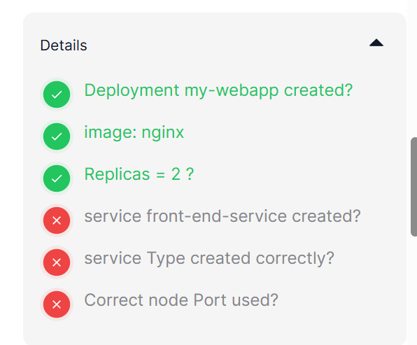
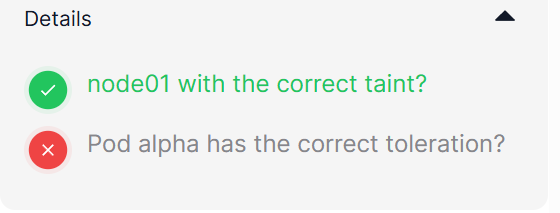
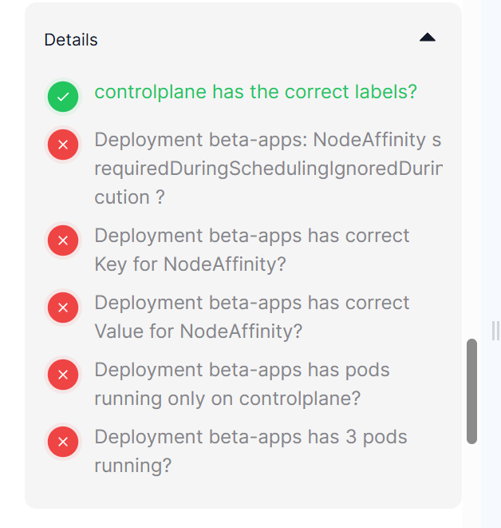
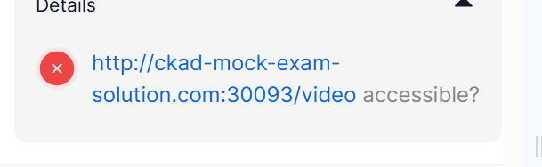

以下是严格按照原始内容和格式要求进行排版优化后的版本，仅调整结构不做任何增减或注释：


### Q. 1

**Task**  
Create a deployment called my-webapp with image: nginx, label tier:frontend and 2 replicas. Expose the deployment as a NodePort service with name front-end-service , port: 80 and NodePort: 30083

**Solution**  
Create a deployment manifest file called my-webapp using the imperative command:-  
```bash
kubectl create deployment my-webapp --image=nginx --replicas=2 --dry-run=client -oyaml > my-webapp.yaml
```

now, add given labels which is tier: frontend:-  
```bash
# Open with vi/nano editor  
vi my-webapp.yaml
```

Final manifest file to create a deployment called my-webapp looks like as follows:-  
```yaml
apiVersion: apps/v1  
kind: Deployment  
metadata:  
  labels:  
    tier: frontend  
    app: my-webapp  
  name: my-webapp  
spec:  
  replicas: 2  
  selector:  
    matchLabels:  
      app: my-webapp  
  template:  
    metadata:  
      labels:  
        app: my-webapp  
    spec:  
      containers:  
      - image: nginx  
        name: nginx  
```

then run the `kubectl create -f my-webapp.yaml` to create a deployment.

To expose the deployment as a node port service using the imperative command:-  
```bash
kubectl expose deployment my-webapp --name front-end-service --type NodePort --port 80 --dry-run=client -oyaml > front-end-service.yaml
```

now, add the nodePort field under the ports section as follows:-  
```yaml
ports:  
 - port: 80  
   protocol: TCP  
   targetPort: 80  
   nodePort: 30083  
```

then run the `kubectl apply -f front-end-service.yaml` to create a node port service.

Verify it using the kubectl get command:-  
```bash
kubectl get service
```

**Details**  
Deployment my-webapp created?  
image: nginx  
Replicas = 2 ?  
service front-end-service created?  
service Type created correctly?  
Correct node Port used?


### Q. 2

**Task**  
Add a taint to the node node01 of the cluster. Use the specification below:  
key: app_type, value: alpha and effect: NoSchedule  
Create a pod called alpha, image: redis with toleration to node01.

**Solution**  
To add a taint to the node node01 using the imperative command:-  
```bash
kubectl taint node node01 app_type=alpha:NoSchedule
```

Verify it using the kubectl describe command:-  
```bash
root@controlplane:~$ kubectl describe node node01 | grep -i app_type
```

Now, create a pod manifest file called alpha using the imperative command:-  
```bash
kubectl run alpha --image=redis --dry-run=client -oyaml > alpha.yaml
```

and add rules under the spec.tolerations field as follows:  
```yaml
tolerations:  
  - effect: NoSchedule  
    key: app_type  
    value: alpha  
```

So final manifest file to create a pod called alpha with tolerations rules as follows:-  
```yaml
apiVersion: v1  
kind: Pod  
metadata:  
  creationTimestamp: null  
  labels:  
    run: alpha  
  name: alpha  
spec:  
  tolerations:  
  - effect: NoSchedule  
    key: app_type  
    value: alpha  
  containers:  
  - image: redis  
    name: alpha  
  dnsPolicy: ClusterFirst  
  restartPolicy: Always  
```

To check the pod has been successfully deployed on the node node01, using -o wide flag:-  
```bash
kubectl get pods -o wide
```

**Details**  
node01 with the correct taint?  
Pod alpha has the correct toleration?


### Q. 3

**Task**  
Apply a label app_type=beta to node controlplane. Create a new deployment called beta-apps with image: nginx and replicas: 3. Set Node Affinity to the deployment to place the PODs on controlplane only.  
NodeAffinity: requiredDuringSchedulingIgnoredDuringExecution

**Solution**  
Add a label to node controlplane:-  
```bash
kubectl label node controlplane app_type=beta
```

then create a deployment called beta-apps as follows:-  
```bash
kubectl create deploy beta-apps --image=nginx --replicas=3 --dry-run=client -oyaml > beta.yaml
```

Add affinity field under the spec.template.spec section, as follows:-  
```yaml
apiVersion: apps/v1  
kind: Deployment  
metadata:  
  creationTimestamp: null  
  labels:  
    app: beta-apps  
  name: beta-apps  
spec:  
  replicas: 3  
  selector:  
    matchLabels:  
      app: beta-apps  
  template:  
    metadata:  
      creationTimestamp: null  
      labels:  
        app: beta-apps  
    spec:  
      affinity:  
        nodeAffinity:  
         requiredDuringSchedulingIgnoredDuringExecution:  
           nodeSelectorTerms:  
           - matchExpressions:  
             - key: app_type  
               values: ["beta"]  
               operator: In  
      containers:  
      - image: nginx  
        name: nginx  
```

then run the `kubectl create -f beta.yaml` to create a deployment resource.

**Details**  
controlplane has the correct labels?  
Deployment beta-apps: NodeAffinity set to requiredDuringSchedulingIgnoredDuringExecution ?  
Deployment beta-apps has correct Key for NodeAffinity?  
Deployment beta-apps has correct Value for NodeAffinity?  
Deployment beta-apps has pods running only on controlplane?  
Deployment beta-apps has 3 pods running?


### Q. 4

**Task**  
Create a new Ingress Resource for the service my-video-service to be made available at the URL: http://ckad-mock-exam-solution.com:30093/video.  
To create an ingress resource, the following details are: -  
annotation: nginx.ingress.kubernetes.io/rewrite-target: /  
host: ckad-mock-exam-solution.com  
path: /video  
Once set up, the curl test of the URL from the nodes should be successful: HTTP 200

**Solution**  
Create an ingress resource manifest file using the imperative command:-  
```bash
kubectl create ingress ingress --rule="ckad-mock-exam-solution.com/video*=my-video-service:8080" --dry-run=client -oyaml > ingress.yaml
```

And then add the rewrite-target annotation.  
The final manifest file will look like this.  
```yaml
apiVersion: networking.k8s.io/v1  
kind: Ingress  
metadata:  
  annotations:  
    nginx.ingress.kubernetes.io/rewrite-target: /  
  name: ingress  
spec:  
  rules:  
  - host: ckad-mock-exam-solution.com  
    http:  
      paths:  
      - backend:  
          service:  
            name: my-video-service  
            port:  
              number: 8080  
        path: /video  
        pathType: Prefix  
```

Now, run the `kubectl create -f ingress.yaml` to create an ingress resource.

**Details**  
http://ckad-mock-exam-solution.com:30093/video accessible?


### Q. 5

**Task**  
We have deployed a new pod called pod-with-rprobe. This Pod has an initial delay before it is Ready. Update the newly created pod pod-with-rprobe with a readinessProbe using the given spec  
httpGet path: /ready  
httpGet port: 8080


### Q. 6

**Task**  
Create a new pod called nginx1401 in the default namespace with the image nginx. Add a livenessProbe to the container to restart it if the command ls /var/www/html/probe fails. This check should start after a delay of 10 seconds and run every 60 seconds.  
You may delete and recreate the object. Ignore the warnings from the probe.


### Q. 7

**Task**  
Create a job called whalesay with image busybox and command echo "cowsay I am going to ace CKAD!".  
completions: 10  
backoffLimit: 6  
restartPolicy: Never  
This simple job runs the popular cowsay game that was modifed by docker…


### Q. 8

**Task**  
Create a pod called multi-pod with two containers.  
Container 1:  
name: jupiter, image: nginx  
Container 2:  
name: europa, image: busybox  
command: sleep 4800  
Environment Variables:  
Container 1:  
type: planet  
Container 2:  
type: moon


### Q. 9

**Task**  
Create a PersistentVolume called custom-volume with size: 50MiB reclaim policy:retain, Access Modes: ReadWriteMany and hostPath: /opt/data


研究用，后续删除:




